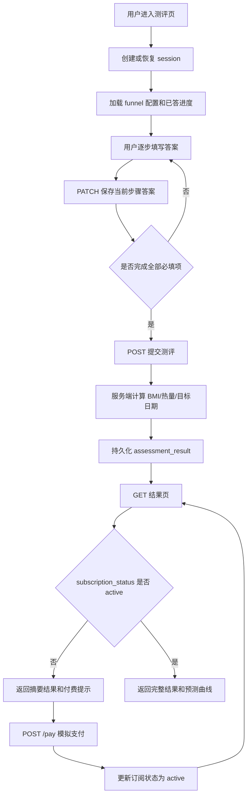
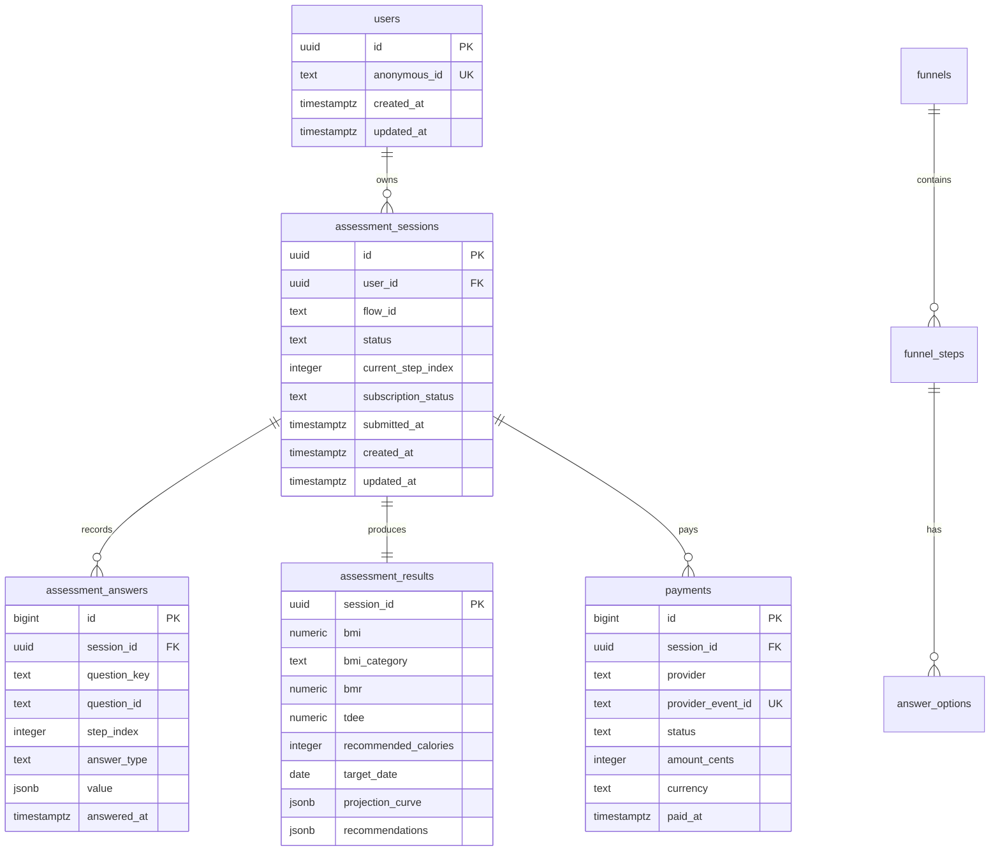

# 健康测评系统需求文档与技术选型

版本：v0.1  
日期：2026-05-08  
依据：`docs/instruction.md`、BetterMe 公开页面数据抓取结果 `scrape/betterme_scrape/betterme_public_data.json`

## 1. 项目背景

本项目是一个健康测评 funnel 的全栈挑战。考查重点不是像素级 UI，也不是简单跑通表单，而是围绕健康测评业务搭建一个可信的后端工程骨架：

- API 路径、方法、请求和响应结构是否专业。
- 数据库建模是否稳定、可扩展、可校验。
- 用户测评过程是否支持分步保存、刷新恢复和最终提交。
- 结果页是否能基于订阅状态做权限保护和差异化返回。
- 模拟支付接口是否能形成完整闭环。

参考竞品 BetterMe funnel 的公开数据中包含 36 个流程步骤、28 个问题，问题类型包括 `single_select`、`multi_select` 和 `input`，并按 My Profile、Activity、Lifestyle & Habits、Nutrition、Almost There 分组。项目不需要 1:1 复刻竞品，但应吸收其数据流设计：首屏选择、分步问题、结果计算、付费前后内容差异。

## 2. 产品定位

构建一个“健康测评 + 个性化计划预览 + 付费解锁完整结果”的轻量系统。

目标用户无需注册即可开始测评。系统通过匿名 `sessionId` 识别用户，持续保存测评进度。用户完成测评后，服务端计算 BMI、建议热量摄入和目标达成日期。未支付用户只能看到摘要结果和付费提示；支付后可看到完整结果、预测曲线和更详细建议。

## 3. 项目目标

### 3.1 必须完成

- 支持创建匿名测评 session。
- 支持按步骤增量保存用户答案。
- 支持刷新或关闭页面后恢复进度。
- 支持服务端健康评估计算。
- 支持计算结果持久化。
- 支持结果页按订阅状态差异化返回。
- 提供 `/pay` 模拟支付接口，将指定 session 的订阅状态更新为有效。
- 提供线上可演示地址、README、API 文档、数据库 Schema 图和已支付测试 sessionId。

### 3.2 不做或弱化

- 不接入真实支付渠道。
- 不实现完整账号密码登录体系。
- 不做医疗诊断，只提供健身和健康管理方向的非医疗建议。
- 不追求复杂动画或像素级 UI 还原。
- 不存储不必要的敏感个人信息。

## 4. 用户与角色

| 角色 | 说明 | 关键行为 |
| --- | --- | --- |
| 匿名测评用户 | 首次进入 funnel 的普通用户 | 创建 session、填写答案、提交测评、查看部分结果 |
| 已支付用户 | 完成模拟支付的 session | 查看完整结果、预测曲线、详细建议 |
| 评审者 | 挑战评审人员 | 通过线上 URL 跑完整流程，通过 cURL 调用 `/pay` 验证前后差异 |
| 系统服务 | 后端业务逻辑 | 验证数据、持久化答案、计算结果、鉴权返回 |

## 5. 核心业务流程



## 6. 功能需求

| 编号 | 需求 | 优先级 | 说明 |
| --- | --- | --- | --- |
| FR-01 | 创建 session | P0 | 首次进入时生成 `sessionId`，写入 httpOnly cookie，同时返回给前端和 README 测试使用 |
| FR-02 | 恢复进度 | P0 | 根据 `sessionId` 返回已答问题、当前步骤、session 状态和订阅状态 |
| FR-03 | 分步保存答案 | P0 | 每完成一步调用接口，按 `sessionId + questionKey` upsert 增量数据 |
| FR-04 | 输入校验 | P0 | 所有答案经过 Zod/服务端 schema 校验，拒绝非法类型、非法枚举和越界数值 |
| FR-05 | 最终提交 | P0 | 校验必填项完整性，生成并持久化健康评估结果 |
| FR-06 | 结果摘要返回 | P0 | 未付费用户只能获取 BMI、概览文案、部分建议和 `paywall` 信息 |
| FR-07 | 完整结果返回 | P0 | 付费用户获取 BMI、建议摄入量、目标日期、预测曲线、详细建议 |
| FR-08 | 模拟支付 | P0 | `/pay` 接收 `sessionId`，创建 payment 记录并将订阅状态改为 `active` |
| FR-09 | 可重复调用 | P1 | 重复保存答案、重复提交和重复支付必须幂等或返回清晰状态 |
| FR-10 | 测试数据 | P1 | README 提供一个未支付 session 和一个已支付 session，便于评审对比 |
| FR-11 | API 文档 | P1 | README 中提供核心接口说明和 cURL 示例 |
| FR-12 | 基础前端 funnel | P1 | 页面能引导真实用户从首屏一路填写到付费弹窗 |

## 7. 测评问题范围

MVP 不需要复制 BetterMe 的 28 个问题，但需要覆盖挑战要求中的核心字段，并保留可扩展的动态问题模型。

### 7.1 必填核心字段

| 字段 | 类型 | 示例 | 校验 |
| --- | --- | --- | --- |
| `gender` | enum | `female` | `female`、`male`、`other` |
| `goal` | enum | `lose_weight` | 预定义目标枚举 |
| `age` | number | `32` | 18 到 80 |
| `heightCm` | number | `165` | 120 到 230 |
| `currentWeightKg` | number | `72` | 35 到 250 |
| `targetWeightKg` | number | `62` | 35 到 250 |
| `activityFrequency` | enum | `light` | `sedentary`、`light`、`moderate`、`active`、`very_active` |

### 7.2 建议补充字段

- `fitnessLevel`：初学、一般、有经验。
- `targetZones`：腹部、臀腿、全身、胸背等多选。
- `sleepQuality`：睡眠质量。
- `dietPreference`：饮食偏好。
- `badHabits`：高糖、含糖饮料、盐分过多、夜宵等。
- `upcomingEvent`：婚礼、旅行、生日、无特殊事件等。

这些字段不一定全部参与核心算法，但能让 funnel 更真实，并给结果页生成更像个性化计划的摘要。

## 8. 服务端计算规则

所有计算必须在服务端完成，前端只负责展示。

### 8.1 BMI

公式：

```text
BMI = currentWeightKg / (heightCm / 100)^2
```

分类：

| 范围 | 分类 |
| --- | --- |
| `< 18.5` | underweight |
| `18.5 - 24.9` | normal |
| `25 - 29.9` | overweight |
| `>= 30` | obese |

### 8.2 基础代谢与建议摄入量

采用 Mifflin-St Jeor 公式：

```text
female: BMR = 10 * weightKg + 6.25 * heightCm - 5 * age - 161
male:   BMR = 10 * weightKg + 6.25 * heightCm - 5 * age + 5
other:  使用 female/male 结果均值
```

活动系数：

| activityFrequency | 系数 |
| --- | --- |
| sedentary | 1.2 |
| light | 1.375 |
| moderate | 1.55 |
| active | 1.725 |
| very_active | 1.9 |

```text
TDEE = BMR * activityFactor
recommendedCalories = TDEE - calorieDeficit
```

减脂目标默认采用温和热量缺口 `300 - 500 kcal/day`，并设置安全下限：女性不低于 1200 kcal/day，男性不低于 1500 kcal/day，其他性别不低于 1350 kcal/day。

### 8.3 目标预测日期

```text
weightDelta = currentWeightKg - targetWeightKg
weeklyLossKg = clamp(weightDelta * 0.08, 0.25, 0.75)
weeksNeeded = ceil(abs(weightDelta) / weeklyLossKg)
targetDate = today + weeksNeeded * 7 days
```

如果目标体重高于当前体重，则使用增肌/增重逻辑，`weeklyChangeKg` 控制在 `0.15 - 0.5 kg/week`。如果目标体重会导致 BMI 低于 18.5，结果中应返回风险提示，不直接承诺目标。

### 8.4 会员专属数据

未付费用户可见：

- BMI 数值和分类。
- 简短健康摘要。
- 模糊目标日期，如 “约 8 到 12 周”。
- `paywall.required = true`。

已付费用户可见：

- 具体建议摄入量。
- 具体目标预测日期。
- 周维度预测曲线 `projectionCurve`。
- 详细训练和饮食建议。
- `paywall.required = false`。

## 9. API 设计

统一响应结构：

```json
{
  "data": {},
  "error": null,
  "meta": {
    "requestId": "req_xxx"
  }
}
```

错误响应：

```json
{
  "data": null,
  "error": {
    "code": "VALIDATION_ERROR",
    "message": "heightCm must be between 120 and 230",
    "details": []
  },
  "meta": {
    "requestId": "req_xxx"
  }
}
```

### 9.1 Session 与进度

| 方法 | 路径 | 用途 |
| --- | --- | --- |
| `POST` | `/api/sessions` | 创建匿名 session |
| `GET` | `/api/sessions/:sessionId` | 获取 session、答案和进度 |
| `PATCH` | `/api/sessions/:sessionId/answers` | 保存一个或多个步骤答案 |
| `POST` | `/api/sessions/:sessionId/submit` | 提交测评并生成结果 |

创建 session 响应示例：

```json
{
  "data": {
    "sessionId": "4ca7d0be-82dd-4b51-9ac1-9d889f2d87a7",
    "status": "in_progress",
    "currentStepIndex": 0,
    "subscriptionStatus": "inactive"
  },
  "error": null,
  "meta": {
    "requestId": "req_01"
  }
}
```

保存答案请求示例：

```json
{
  "currentStepIndex": 5,
  "answers": [
    {
      "questionKey": "heightCm",
      "questionId": "height",
      "answerType": "input",
      "value": 165
    }
  ]
}
```

### 9.2 Funnel 配置

| 方法 | 路径 | 用途 |
| --- | --- | --- |
| `GET` | `/api/funnels/default` | 获取前端渲染所需的步骤、问题和选项 |

MVP 可以将 funnel 配置放在数据库种子数据中，也可以放在代码常量中。推荐落库，方便展示数据库建模能力。

### 9.3 结果与支付

| 方法 | 路径 | 用途 |
| --- | --- | --- |
| `GET` | `/api/sessions/:sessionId/result` | 获取差异化结果 |
| `POST` | `/api/pay` | 模拟支付回调，激活订阅 |

`/api/pay` 请求示例：

```json
{
  "sessionId": "4ca7d0be-82dd-4b51-9ac1-9d889f2d87a7",
  "providerEventId": "mock_evt_001"
}
```

未付费结果响应重点：

```json
{
  "data": {
    "sessionId": "4ca7d0be-82dd-4b51-9ac1-9d889f2d87a7",
    "subscriptionStatus": "inactive",
    "result": {
      "bmi": 26.4,
      "bmiCategory": "overweight",
      "summary": "Your plan is ready. Unlock the full projection and calorie target.",
      "estimatedWeeksRange": "8-12"
    },
    "paywall": {
      "required": true,
      "reason": "subscription_required"
    }
  },
  "error": null,
  "meta": {
    "requestId": "req_02"
  }
}
```

已付费结果响应重点：

```json
{
  "data": {
    "sessionId": "4ca7d0be-82dd-4b51-9ac1-9d889f2d87a7",
    "subscriptionStatus": "active",
    "result": {
      "bmi": 26.4,
      "bmiCategory": "overweight",
      "recommendedCalories": 1680,
      "targetDate": "2026-07-31",
      "projectionCurve": [
        { "week": 1, "weightKg": 71.4 },
        { "week": 2, "weightKg": 70.8 }
      ],
      "recommendations": []
    },
    "paywall": {
      "required": false
    }
  },
  "error": null,
  "meta": {
    "requestId": "req_03"
  }
}
```

## 10. 状态设计

### 10.1 Session 状态

| 状态 | 说明 |
| --- | --- |
| `in_progress` | 正在填写 |
| `submitted` | 用户已提交，等待或已经计算 |
| `result_ready` | 结果已生成 |
| `expired` | 可选，长期未使用 session |

### 10.2 订阅状态

| 状态 | 说明 |
| --- | --- |
| `inactive` | 默认未付费 |
| `active` | 模拟支付成功 |
| `cancelled` | 预留 |
| `refunded` | 预留 |

## 11. 数据库设计

数据库使用 PostgreSQL。遵循以下原则：

- 主键使用 `uuid` 或 `bigint generated always as identity`。
- 时间字段使用 `timestamptz`。
- 可变文本使用 `text`。
- 金额和计算结果使用 `numeric`，避免浮点精度问题。
- 枚举可先用 `text + check constraint`，降低迁移成本。
- 外键列必须加索引。
- 对常用查询条件建立组合索引，如 `session_id + question_key`。
- 对 active subscription 可使用 partial index。
- 如果使用 Supabase 客户端直连，需要开启 RLS；如果只由服务端访问数据库，也建议保留 RLS 策略作为加分项。

### 11.1 表结构

#### `users`

匿名用户表，可后续扩展成真实账号。

| 字段 | 类型 | 说明 |
| --- | --- | --- |
| `id` | uuid pk | 用户 ID |
| `anonymous_id` | text unique | 浏览器匿名标识 |
| `created_at` | timestamptz | 创建时间 |
| `updated_at` | timestamptz | 更新时间 |

#### `assessment_sessions`

| 字段 | 类型 | 说明 |
| --- | --- | --- |
| `id` | uuid pk | sessionId |
| `user_id` | uuid fk | 关联匿名用户 |
| `flow_id` | text | funnel 标识，默认 `default` |
| `status` | text | `in_progress`、`submitted`、`result_ready`、`expired` |
| `current_step_index` | integer | 当前步骤 |
| `subscription_status` | text | `inactive`、`active`、`cancelled`、`refunded` |
| `submitted_at` | timestamptz nullable | 提交时间 |
| `created_at` | timestamptz | 创建时间 |
| `updated_at` | timestamptz | 更新时间 |

#### `assessment_answers`

| 字段 | 类型 | 说明 |
| --- | --- | --- |
| `id` | bigint pk | 自增 ID |
| `session_id` | uuid fk | 所属 session |
| `question_key` | text | 稳定业务字段，如 `heightCm` |
| `question_id` | text | 问题配置 ID |
| `step_index` | integer | 步骤序号 |
| `answer_type` | text | `single_select`、`multi_select`、`input` |
| `value` | jsonb | 答案值，支持数组和对象 |
| `answered_at` | timestamptz | 回答时间 |
| `created_at` | timestamptz | 创建时间 |
| `updated_at` | timestamptz | 更新时间 |

唯一约束：`unique(session_id, question_key)`，用于分步保存时 upsert。

#### `assessment_results`

| 字段 | 类型 | 说明 |
| --- | --- | --- |
| `session_id` | uuid pk/fk | 所属 session |
| `bmi` | numeric(5,2) | BMI |
| `bmi_category` | text | BMI 分类 |
| `bmr` | numeric(8,2) | 基础代谢 |
| `tdee` | numeric(8,2) | 每日总消耗 |
| `recommended_calories` | integer | 建议摄入量 |
| `target_date` | date | 预测目标日期 |
| `estimated_weeks` | integer | 预计周数 |
| `summary` | jsonb | 摘要文案和标签 |
| `projection_curve` | jsonb | 会员专属预测曲线 |
| `recommendations` | jsonb | 详细建议 |
| `created_at` | timestamptz | 创建时间 |
| `updated_at` | timestamptz | 更新时间 |

#### `payments`

| 字段 | 类型 | 说明 |
| --- | --- | --- |
| `id` | bigint pk | 自增 ID |
| `session_id` | uuid fk | 所属 session |
| `provider` | text | 默认 `mock` |
| `provider_event_id` | text unique | 模拟事件 ID，用于幂等 |
| `status` | text | `succeeded`、`failed` |
| `amount_cents` | integer | 模拟金额 |
| `currency` | text | 默认 `USD` |
| `raw_payload` | jsonb | 原始请求 |
| `paid_at` | timestamptz | 支付时间 |
| `created_at` | timestamptz | 创建时间 |

#### `funnel_steps` 和 `answer_options`

用于展示可扩展建模能力。MVP 可通过 seed 写入默认流程。

| 表 | 关键字段 | 说明 |
| --- | --- | --- |
| `funnels` | `id`、`slug`、`title`、`version`、`is_active` | funnel 定义 |
| `funnel_steps` | `id`、`flow_id`、`step_index`、`type`、`question_key`、`title`、`required` | 步骤与问题 |
| `answer_options` | `id`、`step_id`、`value`、`label`、`sort_order` | 单选和多选选项 |

### 11.2 ER 图



## 12. 技术选型

### 12.1 推荐方案

| 层级 | 选型 | 理由 |
| --- | --- | --- |
| 前端 | Next.js App Router + React + TypeScript | 单仓库完成 funnel 页面和 API，适合 5 天交付；App Router 支持服务端渲染和 Route Handlers |
| API | Next.js Route Handlers | 满足挑战要求的 Node.js + TypeScript；减少 NestJS 独立部署成本 |
| 服务分层 | `src/server/services`、`src/server/repositories`、`src/server/domain` | 即使使用 Next.js，也保持后端代码可测试、可维护 |
| 数据库 | Supabase PostgreSQL | 公网数据库、部署快、可演示；Postgres 适合关系建模和事务 |
| ORM | Prisma | schema 清晰、迁移方便、类型生成稳定，便于评审理解 |
| 校验 | Zod | API DTO、表单校验、业务边界统一定义 |
| 样式 | Tailwind CSS | 快速搭建可信的 funnel UI，不把时间消耗在样式系统上 |
| 测试 | Vitest + Playwright | Vitest 覆盖算法和 API service，Playwright 覆盖端到端流程 |
| 文档 | README + OpenAPI/接口表 + Mermaid ERD | 满足交付物要求，评审可直接复现 |
| 部署 | Vercel + Supabase | 最少运维成本，天然支持 Next.js 和公网演示 |

### 12.2 为什么不优先选 NestJS

NestJS 更适合长期维护的独立后端服务，分层、依赖注入和 OpenAPI 生态更完整。但本挑战周期只有 5 天，且需要同时交付前端 funnel、API、数据库、部署和文档。选择 Next.js Route Handlers 可以减少部署复杂度，把时间集中在数据建模、校验、持久化和权限闭环上。

如果后续要扩展成正式产品，可以将 `src/server` 中的 service 和 repository 迁移到 NestJS，API 合约和 Prisma schema 可以基本复用。

### 12.3 代码结构建议

```text
app/
  (funnel)/
    page.tsx
    result/page.tsx
  api/
    funnels/default/route.ts
    sessions/route.ts
    sessions/[sessionId]/route.ts
    sessions/[sessionId]/answers/route.ts
    sessions/[sessionId]/submit/route.ts
    sessions/[sessionId]/result/route.ts
    pay/route.ts
src/
  server/
    domain/
      assessment.ts
      result-calculator.ts
      subscription.ts
    services/
      session-service.ts
      answer-service.ts
      payment-service.ts
      result-service.ts
    repositories/
      session-repository.ts
      answer-repository.ts
      result-repository.ts
      payment-repository.ts
    validation/
      answer-schema.ts
      session-schema.ts
      payment-schema.ts
  lib/
    prisma.ts
    api-response.ts
prisma/
  schema.prisma
  migrations/
  seed.ts
docs/
  requirements-and-tech-selection.md
  api.md
  ai-retrospective.md
```

## 13. 关键工程约束

### 13.1 数据一致性

- 保存答案使用 upsert，避免用户刷新或重复点击导致重复记录。
- 提交测评时使用事务：更新 session 状态、写入结果、记录提交时间必须一起成功。
- `/pay` 使用 `provider_event_id` 幂等，重复回调不重复创建有效支付。
- 查询结果时必须以后端数据库的 `subscription_status` 为准，不能信任前端状态。

### 13.2 安全与隐私

- `sessionId` 使用 UUID，不使用自增 ID 暴露给前端。
- cookie 设置 `httpOnly`、`sameSite=Lax`、生产环境 `secure`。
- 不存储真实姓名、邮箱、手机号等非必要 PII。
- 所有健康数据只关联匿名 session。
- README 明确说明结果不是医疗诊断。
- Supabase 若启用客户端读写，必须开启 RLS；推荐所有写操作只走服务端 API。

### 13.3 性能

- `assessment_answers.session_id`、`assessment_results.session_id`、`payments.session_id` 必须建索引。
- `assessment_answers` 建立 `unique(session_id, question_key)`。
- `assessment_sessions` 可建立 `(user_id, updated_at desc)` 索引用于恢复最近 session。
- active subscription 查询可使用 partial index：`where subscription_status = 'active'`。
- 对 JSONB 字段不做复杂查询时无需过早建立 GIN 索引。

## 14. 验收标准

### 14.1 API 验收

- 创建 session 返回合法 UUID。
- 保存合法答案返回最新进度。
- 保存非法年龄、身高、体重返回 400 和明确错误码。
- 刷新后通过 `GET /api/sessions/:sessionId` 可恢复答案和步骤。
- 缺少必填字段时提交测评返回 422。
- 完整提交后生成 result。
- 未支付访问 result 时隐藏 `projectionCurve` 和具体 `targetDate`。
- 调用 `/pay` 后再次访问 result 时返回完整数据。
- 重复调用 `/pay` 不破坏状态。

### 14.2 前端验收

- 用户能从首屏开始完整走完 funnel。
- 中途刷新页面后能回到已填写进度。
- 提交后能看到付费提示。
- 点击模拟支付后能看到完整结果。
- 移动端和桌面端都能正常填写。

### 14.3 交付验收

- 有公网可达 URL。
- README 有启动步骤、环境变量、数据库迁移、seed、API cURL 示例。
- README 提供一个已支付测试 `sessionId`。
- 文档包含数据库 Schema 图。
- 文档包含 AI 使用复盘。

## 15. 五天开发排期

| 日期 | 目标 | 产出 |
| --- | --- | --- |
| Day 1 | 初始化项目、确定 schema、实现 Prisma migration 和 seed | 数据库可迁移，funnel 配置可读 |
| Day 2 | 实现 session、进度恢复、分步保存 API | API 可完成增量持久化 |
| Day 3 | 实现计算逻辑、结果持久化、订阅鉴权和 `/pay` | 后端闭环跑通 |
| Day 4 | 实现基础 funnel 前端和结果页，接入 API | 用户可从头到尾演示 |
| Day 5 | 部署、补测试、写 README/API/AI 复盘、准备测试 session | 交付物完整 |

## 16. 风险与应对

| 风险 | 影响 | 应对 |
| --- | --- | --- |
| 过度追求 UI 还原 | 挤压后端时间 | UI 只做可信、清晰、能转化，优先闭环 |
| 动态 funnel 建模过重 | 5 天内实现复杂度上升 | 先支持默认 funnel，schema 保留扩展点 |
| 支付逻辑不幂等 | 重复回调导致状态异常 | `provider_event_id` unique，service 层幂等 |
| 数据校验不足 | 评分扣分明显 | Zod + DB check constraint 双层校验 |
| 部署环境变量错误 | 演示失败 | README 明确 env，部署前准备 seed 和测试 session |

## 17. AI 使用复盘建议

交付时建议单独写 `docs/ai-retrospective.md`，覆盖：

- 如何让 AI 根据挑战要求拆解 API 和数据库模型。
- 如何让 AI 参考 BetterMe 公开数据抽象 funnel 结构，而不是复制素材。
- 如何让 AI 生成 Prisma schema、Zod DTO 和测试用例。
- 哪些业务规则由你人工判断，例如健康算法边界、付费前后数据差异。
- AI 生成内容中你审查和修正过的点，例如隐私边界、幂等支付、数据库索引。

## 18. 当前结论

推荐采用 Next.js App Router + Route Handlers + Prisma + Supabase PostgreSQL 的单仓库方案。它能在 5 天内最大化交付确定性，同时通过清晰的 service/repository/domain 分层、严格 DTO 校验、事务和索引设计，体现后端架构能力。

实现优先级应为：

1. 数据模型和 API 合约。
2. 分步保存与恢复。
3. 服务端计算和结果持久化。
4. 订阅鉴权与 `/pay` 闭环。
5. 基础 funnel 前端与部署文档。
