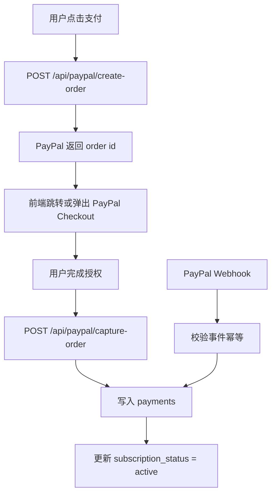

# 2 天开发计划

项目：健康测评 Funnel 系统  
技术栈：Next.js + TypeScript + Supabase + Vercel  
数据来源：已爬取的 BetterMe 公开 Funnel 数据  
后续支付扩展：PayPal

## 1. 目标

在 2 天内完成一个可在线演示的健康测评系统 MVP，重点保证后端闭环完整：

- 使用爬取数据生成测评流程。
- 支持用户分步填写和进度恢复。
- 使用 Supabase 持久化 session、答案、结果和支付状态。
- 服务端计算 BMI、建议摄入量、目标日期和预测曲线。
- 按订阅状态返回不同结果。
- 提供 mock 支付接口，后期可替换或扩展为 PayPal。
- 部署到 Vercel，提供公网演示链接。

## 2. 技术栈确认

| 模块 | 技术选型 | 说明 |
| --- | --- | --- |
| 前端 | Next.js App Router + TypeScript | 承载 funnel 页面、结果页和 API routes |
| 后端 API | Next.js Route Handlers | 减少部署复杂度，适合 2 天快速交付 |
| 数据库 | Supabase PostgreSQL | 存储用户 session、答案、结果、支付记录和 funnel 配置 |
| 数据访问 | Drizzle ORM | 服务端通过一条 `DATABASE_URL` 连接 Supabase Postgres |
| 校验 | Zod | 校验答案、身体数据、支付请求 |
| 部署 | Vercel | 部署 Next.js 应用 |
| 支付 | Mock Pay，预留 PayPal 字段和接口 | 先跑通支付状态闭环，后续接 PayPal |

## 3. 数据使用方案

已爬取的数据位于：

- `scrape/betterme_scrape/betterme_public_data.json`
- `scrape/betterme_scrape/betterme_quiz_questions.csv`
- `scrape/betterme_scrape/betterme_raw_next_data.json`

MVP 使用 `betterme_public_data.json` 中的核心字段：

- `firstPage`：首屏标题、年龄卡片、页面文案。
- `quiz.steps`：测评步骤、问题、选项、问题类型。
- `quiz.structureGroups`：步骤分组。
- `resources.images`：图片资源 ID 和图片 URL。

处理原则：

- 不 1:1 复制商业产品，只使用公开数据作为参考和 mock seed。
- 保留题目顺序、题型、选项结构，快速生成真实感较强的 funnel。
- 将题目配置落入 Supabase，避免前端硬编码。
- 结果计算逻辑由本项目服务端独立实现。

## 4. 数据库计划

### 4.1 Day 1 必建表

| 表 | 用途 |
| --- | --- |
| `funnels` | 存储 funnel 基础信息 |
| `funnel_steps` | 存储题目、信息页、loader 等步骤 |
| `answer_options` | 存储单选、多选题选项 |
| `assessment_sessions` | 存储用户测评 session、进度和订阅状态 |
| `assessment_answers` | 存储用户分步答案 |
| `assessment_results` | 存储服务端计算结果 |
| `payments` | 存储 mock 支付记录，预留 PayPal 字段 |

### 4.2 支付字段预留

`payments` 表建议字段：

| 字段 | 说明 |
| --- | --- |
| `id` | 支付记录 ID |
| `session_id` | 关联测评 session |
| `provider` | `mock` 或 `paypal` |
| `provider_order_id` | PayPal order id，后续使用 |
| `provider_capture_id` | PayPal capture id，后续使用 |
| `provider_event_id` | Webhook 或模拟事件 ID，用于幂等 |
| `status` | `created`、`succeeded`、`failed`、`refunded` |
| `amount_cents` | 支付金额，单位 cents |
| `currency` | 币种，如 `USD` |
| `raw_payload` | 原始支付请求或 PayPal webhook payload |
| `paid_at` | 支付成功时间 |
| `created_at` | 创建时间 |

## 5. Day 1 计划：项目骨架 + 数据落库 + 分步保存

### 上午：项目初始化与数据库

目标：搭好工程底座，Supabase 中能存放 funnel 和用户数据。

任务：

1. 初始化 Next.js + TypeScript 项目。
2. 配置数据库环境变量：
   - `DATABASE_URL`
3. 创建数据库表。
4. 编写 seed 脚本，将 `betterme_public_data.json` 转换为：
   - `funnels`
   - `funnel_steps`
   - `answer_options`
5. 确认 Supabase 中能查到完整题目流程。

验收：

- 本地项目可启动。
- Supabase 表创建成功。
- 爬取数据可成功导入。
- `funnel_steps` 中至少包含题目步骤、题型、标题、选项。

### 下午：核心 API

目标：后端能创建 session、返回题目、保存答案、恢复进度。

实现接口：

| 方法 | 路径 | 说明 |
| --- | --- | --- |
| `GET` | `/api/funnels/default` | 获取默认 funnel 配置 |
| `POST` | `/api/sessions` | 创建匿名测评 session |
| `GET` | `/api/sessions/:sessionId` | 获取 session 和已填答案 |
| `PATCH` | `/api/sessions/:sessionId/answers` | 分步保存答案 |

关键逻辑：

- `POST /api/sessions` 创建 UUID session。
- `PATCH /answers` 使用 upsert，避免重复保存生成脏数据。
- 每次保存答案时更新 `current_step_index`。
- `GET /sessions/:sessionId` 返回已填答案和当前步骤，用于刷新恢复。
- 使用 Zod 校验请求体。

验收：

- 创建 session 成功。
- 保存单选、多选、输入题答案成功。
- 刷新后可以根据 sessionId 恢复答案和当前进度。
- 非法年龄、身高、体重会被拒绝。

### 晚上：基础前端 Funnel

目标：用户能从页面上走完整个测评流程。

任务：

1. 实现首页或 funnel 页面。
2. 从 `/api/funnels/default` 拉取题目配置。
3. 支持渲染：
   - 信息页
   - 单选题
   - 多选题
   - 输入题
4. 每一步点击下一步时保存答案。
5. 页面刷新后通过 sessionId 恢复进度。

验收：

- 用户可以从首屏一路填写到最后。
- 已填答案被写入 Supabase。
- 刷新页面后不会丢进度。

## 6. Day 2 计划：计算结果 + 权限闭环 + 部署

### 上午：服务端计算与结果接口

目标：用户提交测评后，后端生成健康评估结果。

实现接口：

| 方法 | 路径 | 说明 |
| --- | --- | --- |
| `POST` | `/api/sessions/:sessionId/submit` | 提交测评并计算结果 |
| `GET` | `/api/sessions/:sessionId/result` | 获取差异化结果 |

计算内容：

- BMI。
- BMI 分类。
- BMR。
- TDEE。
- 建议每日摄入量。
- 目标预测日期。
- 周维度体重预测曲线。
- 简短健康建议。

权限逻辑：

- 未支付用户：
  - 返回 BMI。
  - 返回 BMI 分类。
  - 返回摘要文案。
  - 返回模糊周期。
  - 不返回完整预测曲线和详细热量数据。
- 已支付用户：
  - 返回完整结果。
  - 返回预测曲线。
  - 返回具体目标日期。
  - 返回建议摄入量和详细建议。

验收：

- 提交完整答案后生成 `assessment_results`。
- 未支付访问结果页时数据被脱敏。
- 已支付访问结果页时返回完整数据。

### 下午：Mock 支付 + PayPal 预留

目标：跑通支付状态闭环，并为后续 PayPal 接入留好结构。

实现接口：

| 方法 | 路径 | 说明 |
| --- | --- | --- |
| `POST` | `/api/pay` | mock 支付成功，将 session 设为 active |

mock 支付逻辑：

1. 接收 `sessionId`。
2. 写入 `payments` 表。
3. 设置 `provider = mock`。
4. 设置 `status = succeeded`。
5. 更新 `assessment_sessions.subscription_status = active`。
6. 返回支付成功信息。

PayPal 预留接口：

| 方法 | 路径 | 当前状态 | 后续用途 |
| --- | --- | --- | --- |
| `POST` | `/api/paypal/create-order` | 可先写 TODO | 创建 PayPal order |
| `POST` | `/api/paypal/capture-order` | 可先写 TODO | 捕获 PayPal 支付 |
| `POST` | `/api/webhooks/paypal` | 可先写 TODO | 接收 PayPal webhook |

PayPal 后续接入时的状态流：

验收：

- 调用 `/api/pay` 后 session 变成已支付。
- 支付前后调用 result 接口能看到明显差异。
- `payments` 表中保留可扩展到 PayPal 的字段。

### 晚上：部署与交付文档

目标：完成线上演示和评审可复现材料。

任务：

1. 部署到 Vercel。
2. 配置 Vercel 环境变量。
3. Supabase 生产库执行建表和 seed。
4. 准备测试数据：
   - 一个未支付 sessionId。
   - 一个已支付 sessionId。
5. 编写 README：
   - 项目介绍。
   - 技术栈。
   - 本地启动方式。
   - 环境变量说明。
   - Supabase 初始化方式。
   - API 文档。
   - `/api/pay` cURL 示例。
   - 测试 sessionId。
6. 补充关键测试：
   - BMI 计算。
   - 答案校验。
   - 未支付和已支付结果差异。

验收：

- Vercel 链接公网可访问。
- 可以从头到尾跑完 funnel。
- 可以通过 mock 支付解锁完整结果。
- README 能让评审独立复现。

## 7. 2 天最终交付物

| 交付物 | 状态要求 |
| --- | --- |
| Vercel 在线链接 | 必须可访问 |
| GitHub 仓库 | 包含完整源码 |
| README | 包含启动、部署、API、测试 session |
| Drizzle Schema / Migration | 表结构完整 |
| Seed 数据 | 使用爬取数据生成题目 |
| `/api/pay` | 可用，可重复演示 |
| 已支付 sessionId | 可直接对比结果差异 |
| 文档 | 包含需求、技术选型、2 天计划、AI 复盘 |

## 8. 优先级排序

2 天时间有限，按以下顺序推进：

1. Drizzle 数据库 schema。
2. 爬取数据 seed。
3. session 创建和恢复。
4. 分步答案保存。
5. 服务端计算。
6. 结果权限差异化。
7. mock 支付。
8. 基础前端。
9. Vercel 部署。
10. README 和测试 session。

如果时间不足，优先牺牲：

- UI 精细度。
- 动画效果。
- 完整 PayPal 接入。
- 复杂推荐算法。
- 全量 BetterMe 题目复刻。

不能牺牲：

- 数据持久化。
- 进度恢复。
- 服务端计算。
- 权限差异化。
- mock 支付闭环。
- 线上可演示。

## 9. PayPal 后续接入计划

2 天内不强行接入真实 PayPal，避免影响核心交付。后续接入按以下步骤：

1. 注册 PayPal Developer 应用，获取 client id 和 secret。
2. 增加环境变量：
   - `PAYPAL_CLIENT_ID`
   - `PAYPAL_CLIENT_SECRET`
   - `PAYPAL_ENV`
   - `PAYPAL_WEBHOOK_ID`
3. 实现 `/api/paypal/create-order`。
4. 实现 `/api/paypal/capture-order`。
5. 实现 `/api/webhooks/paypal`。
6. 校验 webhook 签名。
7. 使用 `provider_event_id` 保证 webhook 幂等。
8. 将 PayPal 支付成功映射为 `subscription_status = active`。
9. 保留 mock pay 作为开发和评审备用通道。

## 10. 每日检查清单

### Day 1 结束前

- [ ] Next.js 项目可本地启动。
- [ ] Supabase 表已创建。
- [ ] 爬取数据已导入 funnel 表。
- [ ] session 可创建。
- [ ] 答案可保存。
- [ ] 进度可恢复。
- [ ] 基础前端能走到最后一步。

### Day 2 结束前

- [ ] 提交后能生成计算结果。
- [ ] 未支付结果被脱敏。
- [ ] mock 支付可激活订阅。
- [ ] 已支付结果返回完整数据。
- [ ] Vercel 部署成功。
- [ ] README 完成。
- [ ] 测试 sessionId 准备完成。
